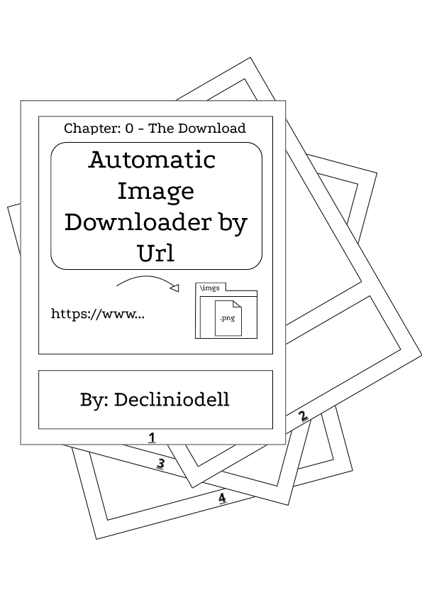
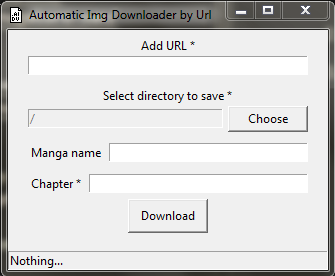
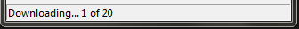
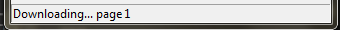

# Automatic Img Downloader by Url

  

This project was made with the intention of downloading a large number of images without having to access them through the browser.

## how to use ?

1. A url link with or without an image at the end.
    
    ### Examples:
    
    - https://www.mangasite.com/web/manga-content/ijiranaide-nagatoro-san/chapter-92/

    - https://www.mangasite.com/web/manga-content/ijiranaide-nagatoro-san/chapter-92/00.png

2. Enter url, select directory to save, enter manga name (optional) and chapter.

    

        
    

3. Click on the download button and enjoy.

## Status

The download status field informs how many pages have been downloaded and how many still need to download.

- 

    

- 

    

